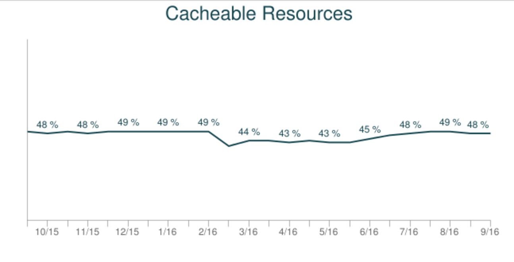
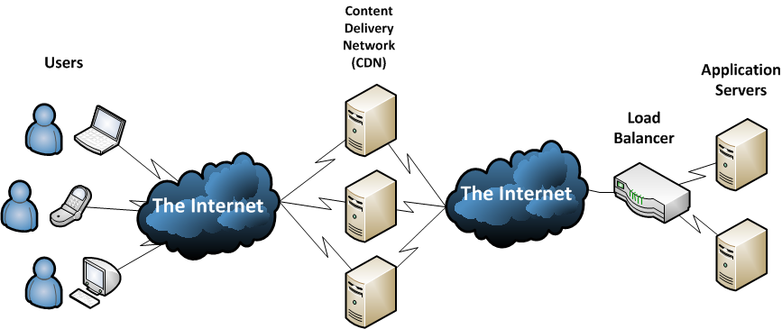

#HTTP Cache

#VSLIDE

Since June 1999

[RFC 2616](https://tools.ietf.org/html/rfc2616)

#VSLIDE

50 percent http hits could be cached


300 000 first sites(Alexa ranking)

#HSLIDE

### HEADERS

#### HTTP Document


#VSLIDE

### HTTP Header


#VSLIDE

#### REQUEST
```HTTP
GET http://www.tiggerwigger.com/ HTTP/1.0
Proxy-Connection: Keep-Alive
User-Agent: Mozilla/5.0 [en] (X11; I; Linux 2.2.3 i686)
Host: www.tiggerwigger.com
Accept: image/gif, image/x-xbitmap, image/jpeg, image/pjpeg, image/png, */*

Accept-Encoding: gzip
Accept-Language: en
Accept-Charset: iso-8859-1, *, utf-8
```

#VSLIDE

#### RESPONSE
```HTTP
HTTP/1.0 200 OK
Date: Fri, 13 Nov 2009 06:57:43 GMT
Content-Location: http://locutus.tiggerwigger.com/index.html
Etag: "07db14afa76be1:1074"
Last-Modified: Thu, 05 Nov 2009 20:01:38 GMT
Content-Length: 7931
Content-Type: text/html
Server: Microsoft-IIS/4.0
Age: 922
Proxy-Connection: close
```

#HSLIDE

#### Good news?

Every browser ships with an implementation of an HTTP cache


#VSLIDE

#### 304 Etag

Validating cached responses with ETags


#VSLIDE

#### How to?

The only thing left to do is to ensure that the server is providing the necessary ETag tokens.

ExpressJs & express.static enable Etag by default

[https://up.coorpacademy.com/config](https://up.coorpacademy.com/config)

#HSLIDE

#### Cache-Control

Each resource can define its caching policy via the Cache-Control HTTP header.


#VSLIDE

#### no-cache" and "no-store"

no-cache: need revalidation

no-store: disallow storage

#VSLIDE

#### "public" vs. "private"

public: cache everywhere

private: cache on browser


#VSLIDE 

#### "max-age"
This directive specifies the maximum time in seconds that the fetched response is allowed to be reused from the time of the request.

For example, "max-age=60" indicates that the response can be cached and reused for the next 60 seconds.

RFC: Max 1 year

#VSLIDE

### Cache-Control directives examples

Cache-Control Header | Explanation
------------ | -------------
max-age=86400 | Response can be cached by browser and any intermediary caches (that is, it's "public") for up to 1 day (60 seconds x 60 minutes x 24 hours).
private, max-age=600 | Response can be cached by the client’s browser only for up to 10 minutes (60 seconds x 10 minutes).
no-store | Response is not allowed to be cached and must be fetched in full on every request.

#VSLIDE

###### Defining optimal Cache-Control policy


#VSLIDE

### Client Caching and quick updates


#VSLIDE

### Caching checklist

* Use consistent URLs
* Ensure that the server provides a validation token (ETag)
* Identify which resources can be cached by intermediaries
* Determine the optimal cache lifetime for each resource
* Determine the best cache hierarchy for your site
* Minimize churn

#HSLIDE

Thank you :-)

#VSLIDE

### Slides

https://github.com/CoorpAcademy/tekacademy/httpcache

### Sources
https://docs.trafficserver.apache.org/en/4.2.x/sdk/http-headers.en.html
https://developers.google.com/web/fundamentals/performance/optimizing-content-efficiency/http-caching?hl=fr
