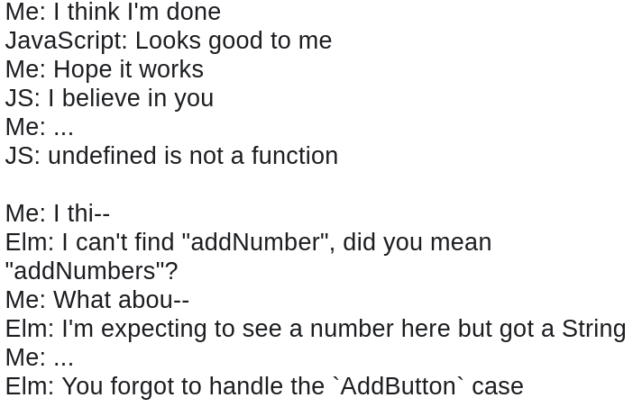

Elm


#HSLIDE
What I want

#VSLIDE
I want to build products

#VSLIDE
but I don't like breaking things

#VSLIDE

```js
validationPromise = () => {
  return new Promise((resolve, reject) => {
    return this.validate() ? resolve() : reject('invoice')
  })
}

onErrorSubmit = error => {
  // not very nice. could improve with error throwing
  const expandInvoiceFields =
    error == 'invoice' ? true : this.state.invoiceFields
  // ...
}
```

#VSLIDE
Can I modify this piece of code without breaking anything?

#VSLIDE

- Flow / TypeScript
- ESLint (I wrote 75 rules, and we enabled 328 rules at my previous company)
- Test-Driven Development
- React propTypes
- Functional programming techniques

They help, but they **only** help

#VSLIDE
I spent my time fixing bugs

#VSLIDE
Bug fixing **!=** building a product

#VSLIDE
I want guarantees that my changes will not break anything

#VSLIDE
If only I had a tool to give me these guarantees...

#HSLIDE
# Elm

#VSLIDE

- Easy to use functional programming language
- Designed to develop webapps
- **Produces no runtime exception**

#VSLIDE

- Compiles to JavaScript
- Can be used with and interact with JavaScript code

#VSLIDE
## Compiler

- Ensures that the resulting code won't crash
- Helps you fix the errors

#VSLIDE

Type mismatch

```elm
addNumbers a b = a + b

result = addNumbers 1 "2"
```


https://ellie-app.com/3DtT78bwsqxa1

#VSLIDE

Variable not found

```elm
addNumbers a b = a + b

result = addNumber 1 2
```


https://ellie-app.com/3DtCx94GVkda1

#VSLIDE

Import cycle

```elm
-- in Main.elm
import Foo exposing (..)

-- in Foo.elm
import Main exposing (..)
```


#HSLIDE
## Language Basics

#VSLIDE
### Immutability

All variables in Elm are constants.
- You can declare constants, but there is no reassignment
- There are no operators or functions that mutate data

#VSLIDE
### Basic types

```elm
1 + 2 -- Int
"hello" ++ " world" -- String
```

#VSLIDE
### Lists & tuples

- List: Contains an undefined number of elements of the same type
- Tuple: Contains a defined number of elements whose type are defined but can be different

```elm
names = ["John", "Jane"] -- List String

result = (404, "Not found") -- Tuple -- (Int, String)
```

#VSLIDE
### Records

```elm
httpResult = { code = 403, error = "Forbidden" }
-- { code : Int, error : String }

httpResultWithSuccess = { httpResult | code = 200 }
-- { code = 200, error = "Forbidden" }
```

#VSLIDE
### If else

- No if without an else
- The whole thing is an expression
- Every "branch" needs to return the same type

```elm
result =
  if foo == 0 then
    1
  else
    2
```

#VSLIDE
### Pattern matching

```elm
boolToString: Bool -> String
boolToString bool =
  case bool of
    True -> "True"
    False -> "False"
```


#VSLIDE
### Function declaration

```elm
add a b =
  a + b -- function return value

divide a b =
  let
    -- function intermediate constants
    quotient = a // b
    remainder = a % b
  in
    (quotient, remainder) -- function return value
```

#VSLIDE
### Function usage

Functions are curried and support partial application

```elm
result = add 1 2
-- 3

-- add1: Function that will add 1 to parameter that it's given
add1 = add 1
result = add1 2
-- 3
```

#HSLIDE

Let's code an app: Message board

https://ellie-app.com/3DYXXYSBFRga1

#VSLIDE

Display messages

https://ellie-app.com/3DYTwcT2tLma1

#VSLIDE

```elm
main =
    Browser.sandbox
        { init = init
        , view = view
        , update = update
        }
```

#VSLIDE

```elm
init =
    { messages = [ "Oh hi there!", "How you doing?" ] }

update msg model =
    model

view model =
    ul [] (List.map viewMessage model.messages)

viewMessage message =
    li [] [ text message ]
```

#VSLIDE

Add an input field

https://ellie-app.com/3DYXsZHfG36a1

#VSLIDE

```elm
init = { messages = [ "Oh hi there!", "How you doing?" ], content = "" }

type Msg = SetContent String
update msg model =
    case msg of
        SetContent str ->
            { model | content = str }

view model =
    div []
        [ ul [] (List.map viewMessage model.messages)
        , input [ type_ "text", onInput SetContent, value model.content ] []
        ]
```

#VSLIDE

Post a message

https://ellie-app.com/3DYXXYSBFRga1

#VSLIDE

```elm
type Msg = SetContent String | PostMessage

update msg model =
    case msg of
        SetContent str -> { model | content = str }
        PostMessage ->
            { model | content = "", messages = List.append model.messages [ model.content ] }

view model =
    div []
        [ ul [] (List.map viewMessage model.messages)
        , input [ type_ "text", onInput SetContent, value model.content ] []
        , button [ onClick PostMessage ] [ text "Post" ]
        ]
```

#VSLIDE
### The Elm architecture


#HSLIDE
## Types

#VSLIDE
### Type annotations

Type annotations are meant for programmers,
because Elm can discover most of the types on its own.

```elm
add: Int -> Int -> String
--   Int -> -- Takes a integer as a parameter
--          Int -> -- Takes a integer as a parameter
--                 String -- returns a String
add a b = String.fromInt (a + b)

getName: { name: String } -> String
getName a = a.name
```

#VSLIDE
### Type aliases

Great for documentation and simplifying

```elm
type alias User =
    { name : String
    , age: Int
    }

updateName : String -> User -> User
-- Similar to
updateName :
  String -> {name: String, age: Int} -> {name: String, age: Int}
```

#VSLIDE
### Creating union types

```elm
type CardColor = Black | Red
type CardValue = Ace | King | Queen | Jack | Two | Three | ...
type alias Card = { color: CardColor, value: CardValue }

type HttpResponse
  = HttpError Int String -- will contain a Int and a String value
  | HttpSuccess String   -- will contain a String value
```

#HSLIDE
## Effects

#VSLIDE
### Functional programming

Functional programming is about eliminating side-effects
where you can, control them where you can't.
                                            Kris Jenkins

https://www.youtube.com/watch?v=tQRtTSIpye4
http://blog.jenkster.com/2015/12/what-is-functional-programming.html

#VSLIDE
### No side-effects, only well-handled effects

To apply effects, create a request for it, and return it to the runtime.
They are passed to Elm's runtime which will execute it

```elm
update msg model =
    case msg of
      RequestUrl -> (model, getRandomGif "cats")
      NewGif body -> ({model | body = body}, Cmd.none)


giphyUrl = "https://api.giphy.com/v1/gifs/random?api_key=dc6zaTOxFJmzC"
getRandomGif topic =
    Http.send NewGif (Http.getString giphyUrl)
```

#VSLIDE
## Ports

System to communicate safely with JavaScript code by message passing.

The JS code may crash, but the Elm code won't.

#HSLIDE
### Overview

#VSLIDE
### Elm is great for refactoring

#VSLIDE

What weird states can I have here?
```elm
type alias Model =
    { questions : List String
    , answers : List (Maybe String)
    }
```

#VSLIDE

What weird states can I have here?
```elm
type alias Model =
    { questions : List String
    , answers : List (Maybe String)
    }

{ questions: []
, answers: [Just "Yes"]
}
```

#VSLIDE
## Creating guarantees

```elm
type alias QuestionAndAnswer =
    { question : String
    , answer : Maybe String
    }

type alias Model = List QuestionAndAnswer
```
Having more answers than questions is now impossible to represent

#VSLIDE
## Creating guarantees (resources)

"Making Impossible States Impossible" by Richard Feldman
https://www.youtube.com/watch?v=IcgmSRJHu_8

"How Elm slays a UI antipattern" by Kris Jenkins
http://blog.jenkster.com/2016/06/how-elm-slays-a-ui-antipattern.html

#VSLIDE
## Keep less in your head

Somewhere in our code, we are sending a HTTP request, let's look for it
```elm
updateName : String -> User -> User
updateBirthday : Date -> User -> User
saveUser : User -> Cmd Msg
```

#VSLIDE
## Keep less in your head

"Scaling Elm apps" by Richard Feldman
https://www.youtube.com/watch?v=DoA4Txr4GUs

"Advanced Types in Elm (series)" by Charlie Koster
https://medium.com/@ckoster22/advanced-types-in-elm-opaque-types-ec5ec3b84ed2

#VSLIDE
## No magic

- The code is explicit, and there is no weird voodoo magic
- Instead there is boilerplate

- "One thing I've learned from Rails: there are worse things than boilerplate." Richard Feldman

#VSLIDE
## The language will evolve

- Language features will be added or removed to make the language **simpler**
- Breaking changes
- Elm 0.18 -> 0.19: 21 months

#HSLIDE
## How to go forward

https://elm-lang.org/blog/how-to-use-elm-at-work

#VSLIDE
## The checklist

- Have an advocate
- Start Small: Introduce Elm gradually (No big refactor)
- Fix a Problem

#VSLIDE
## Things that will be hard

- Re-learning everything that we used side-effects for
  - Updating a value in an array -> List.map
  - Randomness, getting the time, ... -> Cmd
  - ...

#VSLIDE
## Additional resources

- https://guide.elm-lang.org (Official learning guide)
- https://elmlang.slack.com/ (#beginners)

#HSLIDE
## Workshop

Take the previous message board application,
and add a "flush" button that removes all messages.

Start with https://ellie-app.com/3DYXXYSBFRga1
Solution: https://ellie-app.com/3DYYWy3nrjBa1

#VSLIDE

Go further
- Disable post button if field is empty
- Add an input field to set a user name that will display next to each message

#HSLIDE


