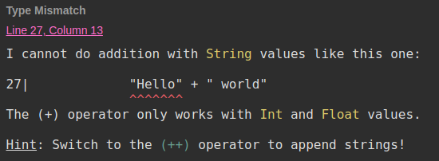
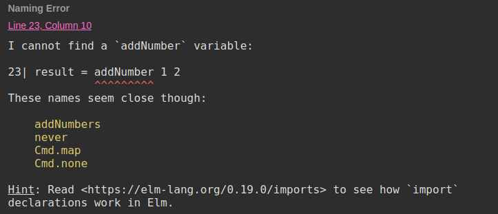

#Elm


#VSLIDE
### What is it?

- Made in 2012 by Evan Czaplicki
- Easy to use functional programming language
- Made to develop webapps

#VSLIDE
### What is it?

- Compiles to JavaScript
- Can be used with and interact with JavaScript code
- **Produces no runtime exception**

#HSLIDE
## Compiler

The aim of Elm's compiler is to compile your Elm code into a crashless JS code
- makes sure that there are no type mismatches
- makes sure that all cases/branches are handled

With the absence of null/undefined in the language,
crashes are then automatically detected.

#VSLIDE

When you have errors,
it tries to be very friendly and helpful

```elm
"Hello" + " world"
```



#VSLIDE

Variable not found

```elm
addSomeNumbers a b = a + b

result = addSomeNumber 1 2
```



#HSLIDE
## Language Basics

#VSLIDE
### Basic types

```elm
1 + 2 -- number
"hello" ++ " world" -- String - only with " quotes
```

#VSLIDE
### Lists & tuples

- List: Contains an undefined number of elements of the same type
- Tuple: Contains a defined number of elements whose type are defined but can be different

```elm
names = ["John", "Jane"] -- List String
result = (404, "Not found") -- Tuple -- (number, String)

List.reverse names
-- ["Jane", "John"] -- List String
```

#VSLIDE
### Records

```elm
httpResult = { code = 404, error = "Not found" }
-- { code : number, error : String }

httpResult.code -- 404
.code httpResult -- 404

httpResultWithSuccess = { httpResult | code = 200 }
-- { code = 200, error = "Not found" }
```

#VSLIDE
### Function declaration

```elm
add a b =
  a + b -- function body

divide a b =
  let
    quotient = a // b
    remainder = a % b
  in
    (quotient, remainder)
```

#VSLIDE
### Functions usage

```elm
result = add 1 2

-- functions are curried
add1 = add 1
result = add1 2
```

#VSLIDE
### If else

- No if without else
- It's an expression

```elm
result =
  if foo == 0 then
    1
  else
    2
```

#HSLIDE
## Types

#VSLIDE
### Type annotations

Type annotations are meant for programmers,
because Elm can discover most of the types on its own.

```elm
add: number -> number -> String
--   number -> -- Takes a number as a parameter
--             number -> -- Takes a number as a parameter
--                       String -- returns a String
add a b = toString (a + b)

getName: { name: String } -> String
getName a = a.name
```

#VSLIDE
### Creating types

```elm
type Bool = True | False
-- This is actually how Bool is implemented

type HttpResponse
  = HttpError number String
  | HttpSuccess String

type Maybe a
  = Nothing
  | Just a

type alias User = {
  name : String
}
```

#VSLIDE
### Conditional case

```elm
fib n =
  case n of
    0 -> 0
    1 -> 1
    _ -> fib (n - 1) + fib (n - 2)

errorMessage: Maybe String -> String
errorMessage error =
  case error of
    Nothing -> ""
    Just message -> message
```

#HSLIDE
## Concepts

#VSLIDE
### Immutability

All values in Elm are immutable.
- You can declare variables, but there is no reassignment
- There are no operators or functions that mutate data

```elm
a = 1 -- OK: declaring a variable
a = 2 -- NOT OK: reassigning a variable
```

#VSLIDE
### No side-effects

Effects are represented by Tasks.
Tasks are plain data structures composed of:
- The action to do
- What to do (dispatch) on success
- What to do (dispatch) on failure

They are passed to Elm's runtime which will execute it

```elm
getRandomGif topic =
  let
    url =
      "https://api.giphy.com/v1/gifs/random?api_key=dc6zaTOxFJmzC&tag=" ++ topic
  in
    Task.perform HttpError HttpSuccess (Http.get decodeGifUrl url)
```

#HSLIDE
### The Elm Architecture

#### Model view update

Basic components that form a reusable architecture

```elm
main =
  Html.beginnerProgram
    { model = model
    , view = view
    , update = update
    }
```


#VSLIDE
### Model

The state of your application

```elm
type alias Model = {
  brands: List String,
  error: Maybe String
}

model : Model
model =
  Model [] Nothing
```

#VSLIDE
### update

A way to update your state

```elm
type Msg
    = FetchBrandSuccess (List String)
    | FetchBrandFailure String
    | EditBrand String
    | SearchBrand String

update: Msg -> Model -> Model
update msg model =
  case msg of
    FetchBrandSuccess newBrands ->
      { model | brands = newBrands, error = Nothing }
    FetchBrandFailure error ->
      { model | error = Just error }
    -- ...
```

#VSLIDE
### view

A way to view your state as HTML

Uses Elm's own virtual dom library

```elm
import Html exposing (..)

view : Model -> Html Msg
view model =
  div [] [ viewError model.error
         , viewBrands model.brands
         ]
```

#VSLIDE
### view

```elm
viewError: Maybe String -> Html Msg
viewError error =
  case error of
    Just s -> span [ class "error" ] [ text s ]
    Nothing -> span [] [ text "" ]

viewBrands: List String -> Html Msg
viewBrands brands =
  div [ class "brands" ]
      (List.map viewBrand brands)

viewBrand: String -> Html Msg
viewBrand brand =
  span
    [ class "brand", onClick (\_ -> EditBrand brand) ]
    [ text brand ]
```

#VSLIDE
### Re-using a component

```elm
import BrandsPage

type alias Model = {
  brands: BrandsPage.Model,
  users: UserPage.Model
}

type Msg
  = Reset
  | BrandsPage.Msg

update msg model =
  case msg of
    BrandsPage.Msg ->
      { model | brands = BrandsPage.update msg model.brands }

view model =
  div [] [ BrandsPage.view model.brands ]
```

#VSLIDE
### Optional: Subscriptions

```elm
import WebSocket

main =
  App.program
    { init = init, view = view, update = update, subscriptions = subscriptions }

subscriptions : Model -> Sub Msg
subscriptions model =
  WebSocket.listen "ws://echo.websocket.org" NewMessage

update: Msg -> Model -> (Model, Cmd Msg)
update msg model =
  case msg of
    Send ->
      ({ model }, WebSocket.send "ws://echo.websocket.org" "a message")

    NewMessage str ->
      ({ model | messages = str :: messages }, Cmd.none)
```

#HSLIDE
## Live-coding

#HSLIDE
## Ports

System to communicate safely with JavaScript code by message passing.

The JS code may crash, but the Elm code won't.

#VSLIDE
## Package manager

Elm has its own package manager.

Packages are semver enforced: API changes require a major version.

#VSLIDE
## :+1:

- Types are awesome (see my Flow talk)
- Having no crashes is awesome
- Easy to refactor a lot
- Easy to read, because there is no magic
- Pretty easy to learn

#VSLIDE
## :-1:

- Need to learn how to do some simple things again
- There is no magic, but there is a lot of boilerplate
- Young language
- Small (but growing) community
