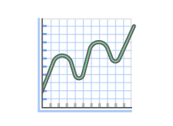

# AWS Lambda


#HSLIDE
## What is AWS Lambda ?


#VSLIDE

## What is AWS Lambda ?

A compute service that runs your code on request on a high-availability compute infrastructure and that performs all of the administration of its own.

#### "Run code without thinking about servers."

#HSLIDE
## What means serverless ?

#VSLIDE
## No Servers to Manage


AWS operates the compute infrastructure : perform health checks, apply security patches, and do other routine maintenance.

#VSLIDE
## Continuous Scaling


Lambda functions are “stateless,” with no affinity to the underlying infrastructure, so that Lambda can rapidly launch as many copies of the function as needed to scale to the rate of incoming events.


#HSLIDE
## How to use it ?

#VSLIDE
## The languages


- Java
- Node.js
- Python
- C#

#VSLIDE
## The triggers


- Amazon API Gateway
- Amazon AWS IoT
- Amazon Alexa
- Amazon CloudFront
- Amazon CloudWatch
- Amazon CodeCommit
- Amazon Cognito
- Amazon DynamoDB
- Amazon Kinesis
- Amazon S3
- Amazon SNS
- SKD
- API


#HSLIDE
## ... A small EC2 ?  


#VSLIDE
## Same same...

The Lambda execution environment runs on Amazon EC2.

Same techniques to provide security and separation at the infrastructure and execution levels.

#VSLIDE
## ... but different !
EC2 offers flexibility :
  - wide range of instance types
  - customisation of the operating system, network and security settings, and the entire software stack
  - capacity
  - fault tolerance and scalability

#HSLIDE
## Pricing


### Number of Requests
$ 0.20 per 1 million requests

### Duration
$ 0.000 016 67 for every GB-second used (rounded up to the nearest 100ms)

### Free per month :
First 1 million requests and 400 000 GB-seconds of compute.

#HSLIDE
## Glance under the bonnet
```python
import os
import platform
import sys

def lambda_handler(event, context):
    print(os.name)
    print(platform.platform())
    print(platform.machine())
```
```
posix
Linux-4.4.35-33.55.amzn1.x86_64-x86_64-with-glibc2.2.5
x86_64
```


#HSLIDE
## In practice

#VSLIDE
## The deployment


```yml
deploy:
  - provider: lambda
    region: eu-west-1
    function_name: "bricklane-archive-firehose-prod"
    role: "arn:aws:iam::446570804799:role/bricklane-archive-firehose-prod-role"
    runtime: nodejs4.3
    access_key_id: $AWS_ACCESS_KEY_ID
    secret_access_key: $AWS_SECRET_ACCESS_KEY
    zip: "lambda_functions/bricklane_archive_firehose"
    module_name: "index"
    handler_name: "handler"
    timeout: 20
    memory_size: 1024
    skip_cleanup: true
    on:
      branch: master

```
