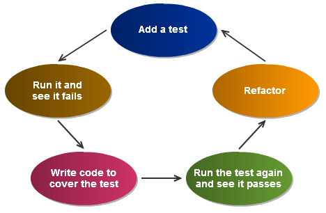
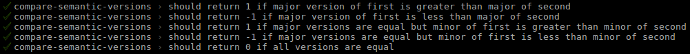

# TDD - Test-Driven Development

#HSLIDE
### What is Test-Driven Development?

- TDD is a **disciplined** method of writing code, that puts the emphasis on testing before writing code in an iterative process

- Brings benefits that can only be gained by writing the code in a certain way. The benefits are absent if the tests are written afterwards

#VSLIDE
### What TDD is absolutely not

"I've finished the code, now I'm adding tests"


#HSLIDE
### The process

- If the test doesn't fail at first, then the test is probably not well written
- Refactor the code without breaking tests or adding support for new cases (optional)

#VSLIDE
### The process

- Adding a test: new test, new assertion in an existing test

- Whenever you think of a case, write the test title `test.todo('should...')` and implement it later

- Never touch the code without writing tests first, unless when refactoring

#VSLIDE
### The process

- When writing code, try to make it **stupidly simple**, just enough to pass the test

- If you make the code more complex at an iteration, then you may have handled a case for which you do not have a test

- When adding code, always try to think "What could go wrong with what I just added?", and add tests for those cases

#VSLIDE
### The process when fixing bugs

- Find out the cause of the bug without writing any code (or by removing/stashing it)
- Write tests and (re)write the code the TDD way

#VSLIDE
### What to do if code coverage is not 100%?

- Find out if the piece of code is still useful and relevant
- It is isn't, remove it
- If it is, remove it and then re-add it the TDD way


#HSLIDE
## Good tests

#VSLIDE
### Good test title
- Reading the test titles should make you understand what the function does and when
- Explains the results based on the conditions of the test, both being generalized.
- Form "should <results> when/if <conditions>"

#VSLIDE
### Good test title

```
// Bad
should return false for "abcd"
  // Which behavior is tested here?
should work // GTFO

// Good
should return false when password
  is less than expected length
should return false when password
  does not contain a number and number is required
should return true when password
  contains a number and number is required
should return true when password
  does not contain a number and number is not required
```

#VSLIDE
### Good test title

```
// Bad
should return true for Jack // Why is he considered an admin?
should return true for Paul // How do Paul and Simon differ
  // and why does it mandate a different test?
should return false for Samantha // Is it a gender thing?

// Good
should return true if "admin" is in the user's list of roles
should return true if "admin" is in the user's list of roles
  but not the first role // Maybe this was a bug once
should return false if "admin"
  is not in the user's list of roles
```

#VSLIDE
### Good test

- A test should be self-sufficient with no effects on other tests
- Assertions should be as precise as possible

```js
t.is(user.name, 'John Smith');
// instead of
t.is(typeof user.name, 'string');
t.truthy(user.name);

t.deepEqual(res, {a: 1, b: 2})
// instead of
t.is(res.a, 1);
t.is(res.b, 2);
```


#HSLIDE
## TDD by example

#VSLIDE
### Semantic version comparator
- Objective: Write function that compares two (simplified) semver values
- Values are of the form "{major: number, minor: number}"
- Returns +1 if the first version is greater than the second
- Returns -1 if the first version is less than the second
- Returns 0 if they are equal

#VSLIDE
### Iteration 1 - Writing failing test
```js
function comp(ref1, ref2) {}

test(`should return 1 if major version of first
  is greater than major of second`, t => {
  t.is(
    comp({major: 2, minor: 1}, {major: 1, minor: 1}),
    1
  );
  t.is(
    comp({major: 2, minor: 1}, {major: 1, minor: 10000}),
    1
  );
});
```

#VSLIDE
### Iteration 1 - Writing stupid code
```js
function comp(ref1, ref2) {
  return 1;
}
```

#VSLIDE
### Iteration 2 - Writing failing test
```js
test(`should return -1 if major version of first
  is less than major of second`, t => {
  t.is(
    comp({major: 1, minor: 1}, {major: 2, minor: 1}),
    -1
  );
  t.is(
    comp({major: 1, minor: 10000}, {major: 2, minor: 1}),
    -1
  );
});
```

#VSLIDE
### Iteration 2 - Writing code
```js
function comp(ref1, ref2) {
  if (ref1.major > ref2.major) { return 1; }
  return -1;
}
```

#VSLIDE
### Iteration 3 - Writing failing test
```js
test(`should return 1 if major versions are equal but
  minor of first is greater than minor of second`, t => {
  t.is(
    comp({major: 1, minor: 2}, {major: 1, minor: 1}),
    1
  );
  t.is(
    comp({major: 1, minor: 1}, {major: 1, minor: 0}),
    1
  );
});
```

#VSLIDE
### Iteration 3 - Writing code
```js
function comp(ref1, ref2) {
  if (ref1.major > ref2.major) { return 1; }
  if (ref1.major < ref2.major) { return -1; }
  return 1;
}
```

#VSLIDE
### Iteration 4 - Writing failing test
```js
test(`should return -1 if major versions are equal but
  minor of first is less than minor of second`, t => {
  t.is(
    comp({major: 1, minor: 1}, {major: 1, minor: 2}),
    -1
  );
  t.is(
    comp({major: 1, minor: 0}, {major: 1, minor: 1}),
    -1
  );
});
```

#VSLIDE
### Iteration 4 - Writing code
```js
function comp(ref1, ref2) {
  if (ref1.major > ref2.major) { return 1; }
  if (ref1.major < ref2.major) { return -1; }
  if (ref1.minor > ref2.minor) { return 1; }
  return -1;
}
```

#VSLIDE
### Iteration 5 - Writing failing test
```js
test('should return 0 if all versions are equal', t => {
  t.is(comp({major: 1, minor: 1}, {major: 1, minor: 1}), 0);
});
```

#VSLIDE
### Iteration 5 - Writing code
```js
function comp(ref1, ref2) {
  if (ref1.major > ref2.major) { return 1; }
  if (ref1.major < ref2.major) { return -1; }
  if (ref1.minor > ref2.minor) { return 1; }
  if (ref1.minor < ref2.minor) { return -1; }
  return 0;
}
```

#VSLIDE
### Iteration 5 - Refactoring
```js
function compareNumbers(a, b) {
  if (a > b) {
    return 1;
  }
  return a < b ? -1 : 0;
}

function comp(ref1, ref2) {
  return (
    compareNumbers(ref1.major, ref2.major) ||
    compareNumbers(ref1.minor, ref2.minor)
  );
}
```

#VSLIDE
### Resulting documentation



#VSLIDE
### Without TDD
If we added tests afterwards to get 100% code coverage.
```js
test('should compare semantic versions correctly', t => {
  const version1 = {major: 1, minor: 1};
  const version2 = {major: 2, minor: 1};
  t.is(comp(version1, version1), 0);
  t.is(comp(version1, version2), 1);
  t.is(comp(version2, version1), -1);
});
```


#HSLIDE
### Code coverage
- Code coverage is a measure of non-tested code, not a measure of test quality
- "70% code coverage" should not be read as "70% of the code is (well-) tested", but as "30% of the code can be deleted without tests failing".
- There are no good metrics to indicate and/or verify how well tested a piece of code is. That's why the benefits of TDD are important and hard to reproduce after the fact.

#VSLIDE
### Code coverage
- An object with plenty of fields counts as one line or instruction. It's easy to think that it's covered without having any tests that check the produced values.

#VSLIDE
### Code coverage

```js
function foo(value) {
  return {
    value,
    a: Math.floor(value * 20 / 100) + 100 / value,
    b: Array({length: value})
      .map(n => ({n, value: 100 / value}))
  };
}
test('should foo', t => {
  foo(); // 100% code coverage for `foo`
});
// But tests would still pass and code coverage
// would still be 100% if we change `foo` to
const foo = () => {};
```

#VSLIDE
### TDD Benefits
- Almost guaranteed 100% code coverage
- Resulting code is really well-tested
- Components are testable, and therefore probably well-architectured
- Good test documentation

#VSLIDE
### TDD Cons
- Time-consuming in the short run
- Requires good analysis of the problem, in order not to throw away a lot of work
- Painful when tests are slow
- Hard to do when components are not easily testable
