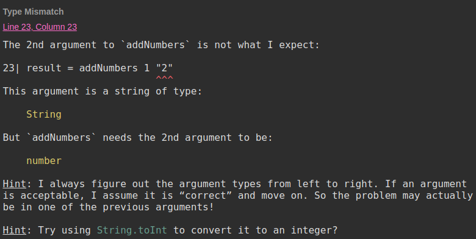
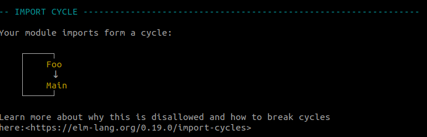
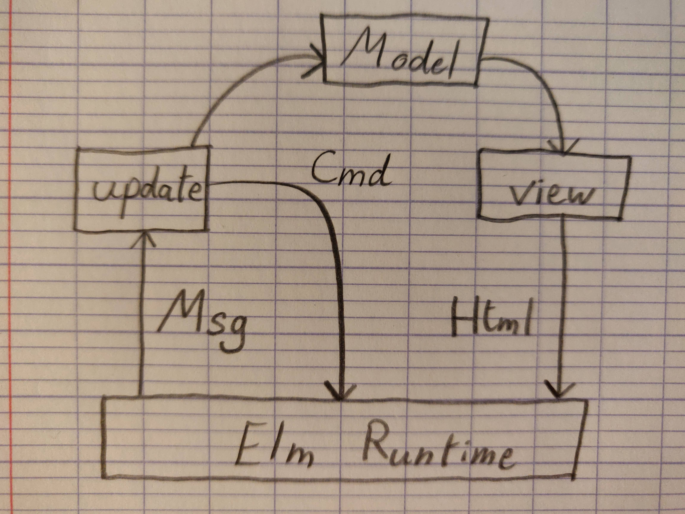

#Elm


#VSLIDE
### What is it?

- Made in 2012 by Evan Czaplicki
- Easy to use functional programming language
- Designed to develop webapps
- Website: http://elm-lang.org/

#VSLIDE
### What is it?

- Compiles to JavaScript
- Can be used with and interact with JavaScript code
- **Produces no runtime exception**

#HSLIDE
## Compiler

- The aim of Elm's compiler is to compile your Elm code into a JS code that won't crash
- The language is made so that this guarantee can be enforced
- It tries to be as helpful and friendly as possible, and to help you fix the errors

#VSLIDE

Type mismatch

```elm
addNumbers a b = a + b

result = addNumber 1 "2"
```


https://ellie-app.com/3DtT78bwsqxa1

#VSLIDE

Variable not found

```elm
addNumbers a b = a + b

result = addNumber 1 2
```


https://ellie-app.com/3DtCx94GVkda1

#VSLIDE

Import cycle

```elm
-- in Main.elm
import Foo exposing (..)

-- in Foo.elm
import Main exposing (..)
```



#HSLIDE
## Language Basics

#VSLIDE
### Basic types

```elm
1 + 2 -- Int
"hello" ++ " world" -- String - only with " quotes
```

#VSLIDE
### Lists & tuples

- List: Contains an undefined number of elements of the same type
- Tuple: Contains a defined number of elements whose type are defined but can be different

```elm
names = ["John", "Jane"] -- List String
result = (404, "Not found") -- Tuple -- (Int, String)

List.reverse names
-- ["Jane", "John"] -- List String
```

#VSLIDE
### Records

```elm
httpResult = { code = 403, error = "Forbidden" }
-- { code : Int, error : String }

httpResult.code -- 403
.code httpResult -- 403

httpResultWithSuccess = { httpResult | code = 200 }
-- { code = 200, error = "Forbidden" }
```

#VSLIDE
### If else

- No if without an else
- The whole thing is an expression
- Every "branch" needs to return the same type

```elm
result =
  if foo == 0 then
    1
  else
    2
```

#VSLIDE
### Function declaration

```elm
add a b =
  a + b -- function return value

divide a b =
  let
    -- function intermediate constants
    quotient = a // b
    remainder = a % b
  in
    (quotient, remainder) -- function return value
```

#VSLIDE
### Currying and partial application

Functions are curried and support partial application

```elm
result = add 1 2
-- 3

-- add1: Function that will add 1 to parameter that it's given
add1 = add 1
result = add1 2
-- 3
```

#HSLIDE
## Types

#VSLIDE
### Type annotations

Type annotations are meant for programmers,
because Elm can discover most of the types on its own.

```elm
add: Int -> Int -> String
--   Int -> -- Takes a integer as a parameter
--          Int -> -- Takes a integer as a parameter
--                 String -- returns a String
add a b =  String.fromInt (a + b)

getName: { name: String } -> String
getName a = a.name
```

#VSLIDE
### Type aliases

Great for documentation and simplifying

```elm
type alias User =
    { name : String
    , age: Int
    }

updateName : String -> User -> User
-- Similar to
updateName : String -> {name: String, age: Int} -> {name: String, age: Int}
```

#VSLIDE
### Type aliases

Fields are not optional

```elm
type alias User =
    { name : String
    , age: Int
    }

-- The compiler will not compile, as `age` is absent
user : User
user =
    { name = "Jeroen"
    }
```

#VSLIDE
### Creating custom types

```elm
type Bool = True | False
-- This is actually how Bool is implemented

type HttpResponse
  = HttpError Int String -- HttpError will contain a Int and a String value
  | HttpSuccess String -- HttpSuccess will contain a String value

type Maybe a -- Maybe is generic and can take any type as argument
  = Nothing
  | Just a
```

#VSLIDE
### Pattern matching

```elm
fib n =
  case n of
    0 -> 0
    1 -> 1
    _ -> fib (n - 1) + fib (n - 2)

errorMessage: Maybe String -> String
errorMessage error =
  case error of
    Nothing -> ""
    Just message -> message
```

#HSLIDE
## Concepts

#VSLIDE
### Functional programming

Functional programming is about eliminating side-effects
where you can, control them where you can't.
                                            Kris Jenkins

https://www.youtube.com/watch?v=tQRtTSIpye4
http://blog.jenkster.com/2015/12/what-is-functional-programming.html

#VSLIDE
### Immutability

All variables in Elm are constants.
- You can declare constants, but there is no reassignment
- There are no operators or functions that mutate data

```elm
a = 1 -- OK: declaring a variable
a = 2 -- NOT OK: reassigning a variable
```

#VSLIDE
### No side-effects, only well-handled effects

Effects are represented by Tasks.
Tasks are plain data structures composed of:
- The action to do
- What to do (dispatch) on success
- What to do (dispatch) on failure

They are passed to Elm's runtime which will execute it

```elm
getRandomGif topic =
  let
    url =
      "https://api.giphy.com/v1/gifs/random?api_key=dc6zaTOxFJmzC&tag=" ++ topic
  in
    Http.send HttpError HttpSuccess (Http.getString url)
```

#HSLIDE
### The Elm Architecture

#### Model view update

Basic components that form a reusable architecture

```elm
import Browser

main =
  Browser.sandbox
    { init = initialModel
    , view = view
    , update = update
    }
```


#VSLIDE
### Model

The state of your application

```elm
type alias Model = {
  brands: List String,
  error: Maybe String
}

model : Model
model =
  Model [] Nothing
```

#VSLIDE
### update

A way to update your state

```elm
type Msg
    = FetchBrandSuccess (List String)
    | FetchBrandFailure String
    | EditBrand String
    | SearchBrand String

update: Msg -> Model -> Model
update msg model =
  case msg of
    FetchBrandSuccess newBrands ->
      { model | brands = newBrands, error = Nothing }
    FetchBrandFailure error ->
      { model | error = Just error }
    -- ...
```

#VSLIDE
### view

A way to view your state as HTML

Uses Elm's own virtual dom library

```elm
import Html exposing (..)

view : Model -> Html Msg
view model =
  div [] [ viewError model.error
         , viewBrands model.brands
         ]
```

#VSLIDE
### view

```elm
viewError: Maybe String -> Html Msg
viewError error =
  case error of
    Just err -> span [ class "error" ] [ text err ]
    Nothing -> span [] [ text "" ]

viewBrand: String -> Html Msg
viewBrand brand =
  span
    [ class "brand", onClick (\_ -> EditBrand brand) ]
    [ text brand ]

viewBrands: List String -> Html Msg
viewBrands brands =
  div [ class "brands" ]
      (List.map viewBrand brands)
```

#VSLIDE
### In a bad drawing




#VSLIDE
### Re-using a component

```elm
import BrandsPage

type alias Model = {
  brands: BrandsPage.Model,
  users: UserPage.Model
}

type Msg
  = Reset
  | BrandsPage.Msg

update msg model =
  case msg of
    BrandsPage.Msg ->
      { model | brands = BrandsPage.update msg model.brands }

view model =
  div [] [ BrandsPage.view model.brands ]
```

#VSLIDE
### Optional: Subscriptions

```elm
import WebSocket

main =
  Browser.document
    { init = init, view = view, update = update, subscriptions = subscriptions }

subscriptions : Model -> Sub Msg
subscriptions model =
  WebSocket.listen "ws://echo.websocket.org" NewMessage

update: Msg -> Model -> (Model, Cmd Msg)
update msg model =
  case msg of
    Send ->
      (model, WebSocket.send "ws://echo.websocket.org" "a message")

    NewMessage str ->
      ({ model | messages = str :: messages }, Cmd.none)
```

#HSLIDE
## Ports

System to communicate safely with JavaScript code by message passing.

The JS code may crash, but the Elm code won't.

#VSLIDE
## Package manager

Elm has its own package manager.

Packages are semver enforced: breaking changes require a major version.

#VSLIDE
## :+1:

- Having guarantees and no crashes is awesome
- Refactorings are easy
- Easy to read, because there is no magic
- The language is small, so it's pretty fast to learn

#VSLIDE
## :-1:

- Need to learn how to do some simple things again
- There is no magic, but there is a lot of boilerplate (but there are worse things than boilerplate)
- Young language
- Small (but growing) community

#VSLIDE
## Additional resources

- https://guide.elm-lang.org
- https://elmlang.slack.com/
- https://ellie-app.com/
- https://www.manning.com/books/elm-in-action
- https://github.com/avh4/elm-format
